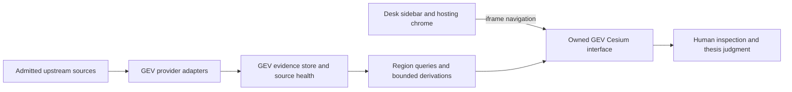

# God Eye: Eigentum, Evidenz und Entscheidungstempo

**Independent architecture thesis · Astra · Triple Brain Phase 1 · 2026-09-13**  
**Product:** owned fork `mrosatoo/gods-eye-view`, workspace `/workspace/gods-eye-view`, inspected branch `cursor/god-eye-owned-basis`.  
**Deliverable:** research and architecture assessment only. No application code, configuration, deployment, provider subscription, or engine change is authorized by this document.

## 1. Urteil: Aus einem eindrucksvollen Globus ein belastbares Lagebild machen

God Eye should be a fast, inspectable account of physical conditions that might matter to a human investment thesis. Its competitive value is the distance from **“something may have changed” to “I understand the evidence, the exposure mechanism, and the remaining uncertainty.”** More markers, sharper imagery and additional feeds do not necessarily shorten that distance.

The owned GEV basis is worth retaining. It already contains Cesium rendering, useful geographic presets, working-source integrations documented in the supplied operational evidence, and meaningful AIS failure handling. The weakest layer is semantic: an upstream connection, a visible object, a persistent observation, an anomaly, an incident and an economic consequence are different things. Today the presentation can encourage an operator to bridge those differences without enough evidence.

**Recommendation:** keep locked Architecture A and evolve GEV internally into an evidence-first, region-oriented console. Preserve the existing display and provider investments; introduce explicit source contracts, geographically scoped observations, a bounded GEV-owned history, and explainable derived observations. Keep the human as the only bridge to an investment thesis. Do not create a Desk signal bus.

Three judgments define this recommendation:

1. **Shipping is the opening question.** Hormuz, Suez, Bab el-Mandeb, Malacca/Singapore and the Cape require route-specific interpretation, not just fly-to buttons. Cobalt is a land supply corridor and must have a different evidence bundle.
2. **Honest gaps are product features.** “Waiting time unavailable” is superior to a precise-looking queue estimated from a sparse snapshot. “No recent observations received here” is different from “the route is empty.”
3. **Visual authority must be earned.** Cyan and Gold can make the console excellent to read. They cannot turn a historical image into a live sensor or a reported incident into confirmed damage.

### Unverhandelbare Grenzen

Desk Sidebar **God Eye View → `/god-eye` → owned GEV `:4173`**, currently embedded as `/?welcome=0&v=2&l=a`. Arch A is locked. Osiris supplies visual inspiration only: Cyan `#00e5ff`, Gold `#ffd700`, implemented inside GEV CSS. No Osiris runtime dependency, `osirisai.live` embed, or foreign Vercel substitute.

**Never:** Bias / Conf / Edge / Sit / FA / Hatch integration, reads or writes into their decision path, lane votes, sizing hints, automatic investment scores, RECON, scanners, offensive tools. Voice remains WONTFIX; no microphone implementation or testing. No junk public webcams as default context. No secrets in documents or commits. No new provider activation follows from this thesis; existing source contracts require explicit authorization before new providers are integrated.

### Evidenzgrenze dieser Untersuchung

This is an independent document/code review plus public primary-source research. I read the five required Desk documents and the relevant owned GEV and Desk hosting code. I did not read another worker's thesis, issue, or comments. I did not run browser QA, start services, query private provider credentials, or reproduce earlier LIVE proofs. **“Reported LIVE” below means the supplied September 11–12 operational evidence; “code-confirmed” means an inspected implementation path; neither is a fresh runtime certification.** Proposed thresholds and acceptance targets are design judgments, not measurements of current performance.

## 2. Was ein Top-Hedgefonds beim ersten Klick verlangt

A portfolio manager does not need to become a globe operator before learning whether this screen contains relevant evidence. The opening surface should answer:

- **Where am I looking, and why?** Named corridor, bounded geographic scope, relevant shipping or facility context.
- **What is observed now, and what changed?** Recent reports, explicit comparison interval, and a clear “history unavailable” state before comparisons exist.
- **How much of reality is observable?** Observation coverage, sample truncation and upstream health; no invented percentage of all ships.
- **What could explain this besides disruption?** Routine anchorage, canal convoy cycles, reception changes, missing reports, seasonality or a geocoding mistake.
- **What should I inspect next?** The selected vessel, the source bulletin, the daily transit series, or the physical site. No trading instruction.

### Zeitbudget und Informationshierarchie

These are proposed operator acceptance targets for a declared reference workstation and network:

| From sidebar click | What should be usable | What must not be implied |
|---|---|---|
| By 3 seconds, warm | Owned GEV shell, selected region, last successful observation metadata or explicit loading state | A painted shell does not mean feeds are live |
| By 10 seconds, warm | Navigable standard basemap, region controls, AIS results or meaningful degraded/empty state | Blank water is not zero shipping |
| Within 30 seconds | Operator can distinguish current observations, lagged series, reports and historical imagery | No aggregate green LIVE badge for all four |
| Within 60 seconds | Operator can state a supported finding, its main alternative explanation, and a verification action | No demand that a disruption actually exists |

Cold start and upstream outage must yield useful status within the same interaction flow; they cannot guarantee fresh source data. Measure the proposed targets, including p95 over repeated warm starts, before adopting them as a service promise.

**Opening composition:** a quiet shipping map; six immediately visible region choices; a compact source-status strip; a right-hand evidence panel for the chosen region; a subordinate comparison chart when verified historical data exists. Start with Hormuz if there is no saved selection. AIS is on; satellites, FIRMS/USGS and photoreal depth are one action away. Do not flood the opening view with every satellite or global fire detection.

**Two kinds of region, not six identical buttons:** the five maritime presets show shipping observations and route context. Cobalt opens a land-corridor view with named geography, FIRMS and USGS access, facility evidence if curated, and explicit truck/water gaps. There are no “live ships in Cobalt.”

### Operator questions by region

| Region | Useful first question | Necessary disambiguation |
|---|---|---|
| Hormuz | Are received transit observations and approach patterns changing? | Tankers are not a verified crude cargo inventory; reception gaps are not a blockade |
| Suez | Are passage activity and approach dwell unusual relative to comparable periods? | Convoys, anchorage and port operations are normal; inspect both canal ends |
| Bab el-Mandeb | Do route activity and independently reported disruptions agree? | Distinguish Red Sea avoidance from a local traffic pause |
| Malacca / Singapore | Which segment or anchorage is affected? | A broad Malacca camera frame cannot define one queue or one transit denominator |
| Cape | Is activity consistent with a diversion hypothesis? | Cape traffic is not a direct count of Suez diversions; route exposure extends beyond Cape Town |
| Cobalt corridor | Is a credible physical event near a specifically identified supply asset? | Regional fire or quake proximity does not establish mine damage, throughput loss or export interruption |

For WTI, the human may investigate an energy-supply mechanism; for Gold or Crypto, a physical incident can be context for a broader regime discussion. God Eye should not encode “incident → asset direction.” Those relationships are conditional and not measured by these feeds.

## 3. Daten-Ehrlichkeitskarte

The word LIVE must attach to a specific measurement, not the product as a whole. The common distinction should be **observed / derived / reported / historical**, independently accompanied by **fresh / delayed / partial / unavailable**. No “confidence score” is needed; source-quality facts are more legible and avoid confusion with the forbidden Conf path.

| Source / layer | Existing evidence | What we may claim | What we cannot claim | Product requirement |
|---|---|---|---|---|
| AISStream / AIS vessels | Reported LIVE; server snapshot and client layer code-confirmed | Received vessel position reports, source age, reported speed/course, bounded recent path | Complete fleet coverage, cargo verification, deliberate AIS shutdown, stuck status, exact queue time | Per-position time quality; region receipt age; reported versus inferred movement; truncation visible |
| IMF PortWatch | GAP; public methodology researched; no integrated adapter found | Once validated: daily transit/port activity and model-based trade proxies | Instantaneous queue length, vessel-level delay, cargo manifests, independently confirmed blockage | Dataset identity, dated metric, unit, revision and source link; waiting unavailable until independently supported |
| CelesTrak / satellites | Reported LIVE; GP/TLE proxy and propagation client exist | Propagated orbital context from published elements | Live reconnaissance imagery, tasking access, sensor collection, proof a satellite is watching a facility | Element epoch and propagation time separate; format coverage explicit |
| NASA FIRMS | Reported LIVE; cached VIIRS source path, 24h filtering and partial-source flags exist | Satellite thermal detections at source acquisition time | Every wildfire, exact perimeter, cause, facility damage, production loss | Source and acquisition time; partial sensors; hotspot versus confirmed fire; persistent industrial-heat context |
| USGS earthquakes | Reported LIVE; `all_day.geojson`, local M2.5+ filter | Published earthquake event, magnitude/depth/time, source identity | Complete damage map, verified infrastructure impact, landslide detection | Display 24h/M2.5+ scope, event revisions and source link; no “no earthquakes” without filter qualification |
| Esri standard basemap | Reported LIVE baseline | Geographic and visual context | Present-time observation or current facility activity | Provider attribution; acquisition date if available, otherwise unknown |
| Cesium Ion / photoreal tiles | Reported LIVE on demand | Detailed spatial context where asset coverage permits | Live video, current truck counts, measured change without dated comparable imagery | Explicit historical/context label, coverage failure state and standard-map fallback |
| Regional news / GDELT | PARTIAL; Google RSS first, GDELT fallback in code | Location-related article discovery and attributable reports | Confirmed incident database, independent corroboration from duplicate articles, precise event coordinates | Event time distinct from publication time; deduplication; original source; region-level placement when uncertain |
| Water stress | GAP in GEV | Candidate: versioned WRI Aqueduct baseline screening after source admission | Current mine water availability, daily drought observation, facility shutdown | Historical/modelled label; basin scope and version; never live water stress |
| Facility truck density | GAP; no admitted facility-specific measurement found | No operational claim today | Counts from TomTom road flow, photoreal meshes, generic CCTV or unresolved satellite pixels | Unavailable by default; enable only per licensed, validated site/source |
| Static infrastructure / cables | Present, secondary; supplied docs identify NC licensing concern | Geographic context after rights/provenance review | Real-time operational status, damage, commercial rights derived from repository MIT license | Dataset-specific rights gate; exclude unsuitable source from commercial profile |
| Aircraft / military labels | Secondary existing layers | Publicly received broadcasts and source classifications | Complete military activity or intent | Off by default; no inference from absence |

AISStream documents a WebSocket subscription and message contract; that establishes transport semantics, not universal reception completeness. [AISStream documentation](https://aisstream.io/documentation).

PortWatch's published methodology describes daily vessel activity and shipment estimates derived from AIS, subject to revision and proxy limitations. This supports a **daily activity context** role. The recommendation not to label that series as live congestion is an architectural inference from the measurement definition. [IMF, Nowcasting Global Trade from Space](https://www.elibrary.imf.org/abstract/journals/001/2025/093/article-A001-en.xml).

FIRMS explicitly distinguishes thermal activity that can arise from vegetation, industrial or natural heat sources. A hotspot alone cannot substantiate a refinery outage. [NASA FIRMS, static thermal anomalies](https://wiki.earthdata.nasa.gov/spaces/FIRMS/blog/2025/02/28/425855667/FIRMS%2Bincorporates%2Bstatic%2Bthermal%2Banomalies%2Bdata%2Bto%2Bhelp%2Busers%2Bdifferentiate%2Bbetween%2Bvegetation%2Band%2Bnon%2Bvegetation%2Bfires.).

USGS provides event `time`, `updated`, identity and detail URLs; use those instead of only the browser's last refresh time. [USGS GeoJSON format](https://earthquake.usgs.gov/earthquakes/feed/v1.0/geojson.php).

### Die vier Uhren

Every useful evidence object should preserve these independently:

1. **Observed/event time:** when the source observation or incident occurred; nullable when unknown.
2. **Published/revised time:** when the provider issued or changed it.
3. **Received time:** when owned GEV obtained it.
4. **Display/analysis time:** the selected as-of time; satellites additionally need element epoch and propagation time.

Refreshing a cache never refreshes the observation. Joining today's AIS to yesterday's daily series is acceptable when both dates remain visible. A screenshot at 14:00 is not evidence that all layers describe 14:00.

### Coverage and missingness

Expose received rows, accepted rows, region rows, rendered subset, source failures, retention window, and last regional observation. Do not label received rows as “all vessels.” A healthy global socket can coexist with no usable Hormuz observations. A zero count may mean a valid zero in a defined sampled dataset; a missing response, missing time interval or truncated snapshot must remain unknown.

Rights are an independent admission dimension. Keyless describes authentication, not redistribution permission or a service guarantee. Owned application code does not transfer ownership of upstream data, imagery or availability. This thesis identifies rights checks; it is not a legal clearance.

## 4. Architekturentscheidungen innerhalb von Arch A

All admissible options retain the owned GEV iframe and the isolation boundary. A different product origin or an Osiris replacement is not a competing option under this assignment.

| Option | Strength | Failure pressure | Judgment |
|---|---|---|---|
| A1: retain snapshot-only GEV; improve defaults and labels | Small change, fast readability gain, minimal operations | No defensible dwell history, weak replay, browser-derived inconsistencies | Good immediate baseline, insufficient for congestion claims |
| A2: GEV display + owned provider adapters + bounded evidence/history store | Shared semantics, limited persistence, independent source recovery, reproducible comparisons | Requires disciplined retention, timestamps, schema and lifecycle ownership | **Recommended internal evolution** |
| A3: dedicated geospatial platform with distributed ingestion, event streaming and large analytical store | Multi-user scale, long history, broad queries | Operating burden, expensive migration, encourages premature signal factory | Defer until measured volume and multi-user needs justify it |
| A4: GEV as a thin client for paid maritime/imagery intelligence | Could provide licensed history and facility observations | Procurement, vendor dependence, cost, entitlement and reproducibility constraints | Conditional later supplement; no procurement implied |

A1 can ship honest observation UX before A2 exists. This is not a promise that a new database is required merely to show ships. Persistence becomes justified when the product promises comparisons across restarts, dwell estimates, event revisions or an as-of evidence record. A3 should not be selected simply because “hedge fund grade” sounds like a distributed system.

### Empfohlene Zuständigkeiten

There is intentionally no analytical return path to Desk. The diagram describes a recommendation, not implemented services.

**Desk owns:** navigation, origin configuration, framing diagnosis and recovery affordance. It must not own observations, event rankings, facility associations or semantic source health. Host reachability should be titled as reachability. No new cross-frame analytical messages are required.

**GEV adapters own:** secrets required for their providers, fetch budgets, retries, caches, schema validation, original source identifiers, source clocks and partial-failure facts. Adapters terminate untrusted upstream input; articles are content, never commands.

**GEV evidence store owns:** normalized observations, compact source snapshots when permitted, immutable first-seen/published times, revisions, region geometry versions and derivation versions. A single owned process and an embedded durable store are a reasonable initial design; no specific database is mandated without volume and retention measurements. Private raw AIS stays bounded and local to GEV.

**Region query layer owns:** stable geographic scope independent of camera position; selection of evidence; aggregation of admitted observations; comparison intervals and suppression rules. Pan/zoom changes rendering, not the denominator of a historical metric. Client LOD or label limits never drive analytical counts.

**GEV UI owns:** two-dimensional reading clarity on a three-dimensional canvas; timestamps, legends, provenance, filters, derived-versus-observed distinctions and an inspectable evidence panel. Optional exported briefs contain what was known and when, not hidden signal scores.

### Minimal evidence contract, conceptual only

| Field group | Required semantics |
|---|---|
| Identity | Stable source ID, provider, record type, canonical source link where safe |
| Time | Observation/event time or null, provider revision, received time, selected as-of time |
| Geography | Geometry, named region, geometry version, placement precision/source |
| Measurement | Value, unit, population/filter, interval; null distinct from zero |
| Provenance | Observed/derived/reported/historical, input references, algorithm version for derivations |
| Quality facts | Missing timestamp, gap, stale source, partial sensor set, truncated cohort, geocoding uncertainty |
| Rights | Dataset version, attribution, allowed retention/export status; unresolved means not admitted for affected use |

Do not embed URLs containing keys in provenance. Preserve source identity through safe public documentation links or sanitized identifiers.

**Retention judgment:** begin with bounded region-level history sized to the actual comparison claim, not a global perpetual archive. If promising multi-day dwell, retain adequate time samples across process restarts and publish the start of reliable history. Never manufacture a baseline from the current session. Daily series can have longer inexpensive retention when redistribution and revision terms permit. Disk pressure must reduce retention explicitly and suppress affected comparisons.

## 5. Angriff auf die heutigen Schwachstellen

The following findings are file-backed. They are not reports of newly reproduced production failures.

### 5.1 The healthy feed can coexist with a misleading ship timestamp

`server/providers/vessels/ais-store.js` and the duplicate store in root `vite.config.js` normalize absent/invalid AIS timestamps to the current time. Cache inclusion and ordering use ingestion `_updatedAt`; `newestAisPositionAt` returns the first row's reported time. Thus the name “newest position” is not a computed maximum over validated source times, and a malformed timestamp can look newly observed.

**Consequence:** source-age and dwell calculations must not treat that fallback as a trusted measurement. Preserve raw source time, normalized nullable source time, received time and a time-quality flag. A latest-valid-source-time aggregate should not disguise excluded unknown-time rows. This is a prerequisite for semantic claims, even though transport liveness logic itself is deliberately careful.

### 5.2 Existing tracks erase the exact evidence needed for dwell

The AIS store retains a ring of 64 samples with at least 30 seconds and 25 metres between stored samples. It explicitly collapses anchored vessels; tracks exist only since server start. The nominal 30-minute stale cache threshold is an eviction policy, not guaranteed continuous 30-minute trajectory coverage. An active vessel's ring can span a different interval depending on motion and receipt patterns.

**Consequence:** “stationary for 45 minutes” cannot be read from this ring. Rendering trails and statistical observations need different retention policies. Keep non-movement time evidence and sampling gaps for dwell; keep thinned paths for display.

### 5.3 Global truncation can change apparent regional density

`src/data/aisLiveVessels.js` requests `maxRows` through `renderRowLimit`, defaulting to 12,000. The server sorts global rows by ingestion recency and slices them. The store cap is 50,000. A busy region elsewhere can alter whether a Hormuz report reaches the client; a render-limit change can change apparent counts without any vessel behavior changing.

**Consequence:** region metrics must run against a clearly defined, pre-render observation population. Future regional queries should report truncation and stable geography; camera and GPU caps must not silently redefine the sample. Narrowing the upstream subscription also changes silence expectations: the existing watchdog disables automatic silence watching for custom subscriptions unless configured. That behavior is intentional and must be considered, not overridden blindly.

### 5.4 Provider refactoring has created two behavioral surfaces

`package.json` starts plain `vite`, loading root `vite.config.js`, which defines substantial provider implementations inline. `server/standalone/vite.config.js` instead imports modular providers. The root CelesTrak proxy uses HTTPS then HTTP fallback and registers via `configureServer`; the modular proxy uses the shared HTTPS URL builder and also registers preview middleware. Therefore reading only `server/providers/*` would misdescribe the default launch path. No claim is made that every provider differs.

**Consequence:** define one supported entrypoint and prove parity before consolidating. For future changes, contract tests must exercise the actual launch path, plus any supported preview path. A static build opening a globe is not proof that server data routes exist. Consolidation is a later engineering task, not performed here.

### 5.5 Desk's LIVE label is a reachability label

`GodEyeClient.tsx` sets `live` from `reach === "embeddable"`, displays `LIVE · GEV / God Eye View`, and stops automatic re-probing once that state is reached. This proves neither successful WebGL render nor current AIS/FIRMS availability; later runtime loss may leave the old host pill until manual re-check.

**Consequence:** distinguish host reachable, viewer usable and each source state. Keep semantic health inside GEV. A lightweight bounded host recheck can cover service loss without creating a GEV-to-Desk analysis channel. Do not implement a data-bearing postMessage bus merely to improve the badge.

### 5.6 Origin isolation is necessary but not a proof of no writes

The inspected frame grants scripts, same-origin, forms and popups, including escaping sandbox for popups. GEV is on a different origin from Desk, which constrains DOM access; the two localhost ports do not by themselves make all cross-origin request attempts impossible. CORS is not a universal write barrier, and localhost port differences are not cookie isolation by themselves.

**Consequence:** verify the actual host/iframe origin pair, exact framing allowlist, origin checks on relevant host endpoints and absence of forbidden request paths. Minimize unnecessary frame capabilities only after checking user-required links. This is a host-boundary recommendation; never inspect or modify Hatch/engine logic to implement a convenience feature. An isolation badge alone is not a security test.

The host also constructs embed URLs through string concatenation, and `isGevUrl` uses port/name heuristics. Existing root-origin URLs fit that path; customized paths/query strings or same-origin deployment need explicit validation. Do not assume those variants inherit the local proof.

### 5.7 Orbital animation can hide catalog incompleteness

Both inspected provider paths request TLE output. CelesTrak's current documentation states that objects with catalog numbers above 99,999 cannot be represented in that format and reports the six-digit transition in July 2026. Existing older objects can continue to appear while new ones are absent. A reassuring satellite count is not a catalog completeness test. [CelesTrak GP formats](https://celestrak.org/NORAD/documentation/gp-data-formats.php).

**Consequence:** future admission should prefer an OMM-compatible JSON/CSV path with tested propagation compatibility, object IDs and epoch handling. Until then say “selected TLE-supported catalog,” never “all satellites.” HTTP fallback in the root implementation additionally weakens transport integrity; a cached authenticated-transport result with explicit age is preferable to silently presenting downgraded transport as equivalent. No migration or transport change is performed in this thesis.

### 5.8 Fire, earthquake and news graphics overpromise without context

FIRMS has useful partial-source flags and re-filters its cache to trailing 24 hours. A prolonged failed refresh can therefore produce an empty recent window even though stale history once existed. The UI must carry both the empty window and the failed refresh.

USGS renders circles with size derived from magnitude (`2^mag × 1000` metres in the inspected layer). Those circles are symbols, not measured damage footprints. Label them accordingly. A regional quake cannot be promoted to a landslide or mine outage.

Regional news currently searches a locality/region/country, takes five articles and falls back from Google RSS to GDELT over 48 hours. That is useful discovery but weak incident extraction: ambiguous place names, duplicates, publication delays and missing precise event locations remain. Provider fallback does not mean independent corroboration.

### 5.9 Presets exist; operational geography is still incomplete

All six requested region keys already exist in `src/locations.js`; rebuilding them would be redundant. Their view bounds are camera framing, not reviewed shipping gates, anchorages, facility boundaries or exposure geometry. Cape bounds and the Cape Town-centered initial view do not describe the entire diversion route. The Cobalt preset names a corridor and cities, not verified mine operating footprints.

**Consequence:** add versioned analytical geography separately when a metric requires it. Never infer a queue from all slow vessels inside a rectangular camera extent.

### 5.10 Default noise and source provenance remain product risks

Desk already enables AIS with share-link state; this is a good basis. Generic missions, persistent local UI state and alternate entrypoints still need explicit thesis-profile acceptance checks. Existing CCTV code includes an upstream → Street View → synthetic fallback chain. That chain must never enter thesis evidence or a facility truck count. A simulated or reconstructed view must remain visibly distinct wherever it exists.

Repository metadata still names upstream in `package.json`; that is not evidence that ownership is wrong. It shows why build identity should record the actual owned revision and entrypoint while preserving upstream attribution. Older Desk documentation also conflicts on defaults and scope. Maintain a short canonical runtime/source contract, rather than treating every historical LIVE table as current truth.

## 6. PortWatch, Stau und „stuck“: realer Pfad statt Fantasie

### PortWatch first means a dated activity series

The public portal and methodology page were reachable in this research, but their dynamic content did not expose a usable dataset schema through the page reader. **No exact ArcGIS item ID, field mapping, current latest observation date, automated download permission or API availability is asserted here.** The IMF methodology is sufficient to establish the product category; it is not an integration smoke test. [PortWatch](https://portwatch.imf.org/) · [Data and methodology](https://portwatch.imf.org/pages/data-and-methodology).

A realistic subsequent source-admission sequence would:

1. Resolve the official published dataset from the portal, preserving publisher identity and a stable dataset/version reference. Do not hard-code an ID copied from old notes without verifying its name and geometry.
2. Inspect schema, units, UTC/day convention, vessel categories, coverage period, revised observations and missing-value conventions. Confirm access without a key and the applicable reuse conditions.
3. Validate two or more dated observations against the official display/download for a chosen chokepoint. Check pagination, record limits, duplicates, sorting and the distinction between zero and missing.
4. Normalize a source snapshot in GEV with original values, fetched time, latest observation day and revision/hash. Poll in line with observed publication cadence; do not hammer a daily dataset like AIS.
5. Display a compact daily series with its actual metric title, scope and source date. Compare like-for-like periods only. If recent days are incomplete or modelled, mark them and suppress strong comparative language.
6. If source access/schema/rights fail, keep an official outbound source link and an explicit integration gap. Never scrape around access restrictions or render synthetic numbers.

**First useful comparison:** a selected daily count beside a clearly defined historical comparator, with sample dates and missingness. A recent-week average versus a comparable historical period is a candidate, not a universal baseline. Publish the formula, minimum history and treatment of missing days. No percentage if the denominator is zero or not comparable. An observed shift is not itself a causal claim.

### The semantic ladder

| Level | Permitted wording | Minimum evidence |
|---|---|---|
| 0: raw | “Received AIS reports” | Valid positions and known time quality |
| 1: measured subset | “Observed low-speed vessels in this zone” | Named geometry, source-age filter, usable speed, explicit sampled population |
| 2: persistence | “Observed low movement across this interval” | Repeated valid observations including stationary samples; gaps disclosed |
| 3: derived anomaly | “Unusual observed dwell relative to this baseline” | Comparable history, zone/class conditioning, minimum support, versioned rule |
| 4: reported disruption | “Authority/operator reports a restriction” | Attributable source, event time, geographic scope, current/retracted status |
| 5: confirmed blockage/impact | Specific bounded finding with evidence | Appropriate corroboration and direct evidence of passage or facility restriction; human-reviewed interpretation |

GEV can stop at any level. There is no automatic promotion from level 1 to “stuck.” A nav-status field, if later preserved, is self-reported evidence, not ground truth. “Dark vessel” must not be used merely because reports disappeared.

### Dwell without false precision

A candidate future classifier could use low-speed and positional-radius tests within reviewed waiting zones, but parameters must be calibrated separately for each corridor and vessel class. This thesis deliberately does not prescribe one global speed threshold as truth.

For a usable dwell observation, record first/last qualifying report, sample count, maximum report gap, time-quality exclusions, zone version and evidence of exit where available. If the first report is already stationary, the start is left-censored: “observed since T,” not arrival time. If observations disappear, the end is unknown. The original trail buffer cannot meet this contract.

Queue length needs a waiting definition: anchorage geometry, direction/approach, berth versus transit context, duplicates and normal operations. Waiting time requires history and defensible state transitions. No ETA should be inferred from a queue count without a validated service model. Strait density and port congestion are separate measurements.

### Triangulation is not independent by default

AISStream and PortWatch can both depend on AIS observations, although their inputs and processing differ. Agreement helps characterize consistency but is not necessarily independent confirmation. Stronger incident interpretation may combine activity changes with an attributable authority/operator restriction, then inspect route alternatives. Count syndicated news copies as one claim family. Record contradiction rather than averaging it away.

## 7. Truck-Dichte und Wasser: harte Zulassungsgrenzen

### Facility truck density: unavailable today is the correct result

No inspected source supplies validated truck counts for the requested facilities. Three future paths are conceivable, none activated here:

| Candidate | What would make it defensible | Main limitation | Disposition |
|---|---|---|---|
| Consented facility gate/logistics data | Timestamped counts, gate coverage, vehicle taxonomy, operating calendar, rights to display | Private access and site-specific integration | Best direct measurement if explicitly authorized |
| Specifically licensed fixed camera | Correct facility/zone, known cadence, visible operating hours, manually validated count error and occlusion | Privacy/rights, darkness, weather, blocked views, camera movement | Narrow site-level pilot only; no generic public-camera substitute |
| Licensed high-resolution dated imagery | Adequate native resolution, repeated comparable acquisitions, count validation and provider terms allowing analysis | Cost, clouds, revisit, shadows, mixed vehicle classes | Potential research product; not live facility truth |

Sentinel-2's highest-resolution bands are 10 metres. Enlarging their rendered pixels does not add spatial information. This makes robust individual truck counting an unsupported default from that imagery; a large-area change proxy would be a different measurement requiring its own validation. [Copernicus Sentinel-2 collection](https://dataspace.copernicus.eu/data-collections/copernicus-sentinel-missions/sentinel-2) · [Sentinel-2 L2A band resolutions](https://documentation.dataspace.copernicus.eu/APIs/SentinelHub/Data/S2L2A.html).

TomTom road flow is not a truck census at a mine gate. Photoreal 3D tiles are spatial context, not repeated calibrated observations. A model-generated count cannot repair missing observations. Even an accurate vehicle count is not production tonnage: shift patterns, stockpiles, loading, route changes and vehicle capacity can break that inference.

Admission must be per site: named boundary, known observation support, measurement interval, validated error description, source freshness and a stop condition for occlusion or missing input. Otherwise display **“Facility truck activity: no validated source.”** Do not populate decorative density gauges.

### Water: a credible structural layer exists, a live facility claim does not

WRI Aqueduct 4.0 is a plausible source candidate for **baseline water-risk screening**, with published downloadable data and CC BY 4.0 attribution conditions. Its baseline is not real-time; the quantity indicators use a historical modelled period spanning 1979–2019. “Monthly baseline” refers to seasonal baseline structure, not this month's observed water supply. [WRI Aqueduct FAQ](https://www.wri.org/aqueduct/faq) · [WRI data catalog](https://www.wri.org/aqueduct/data).

A realistic admission path is a versioned public download, a checked data dictionary and attribution record, then a static basin layer spatially associated with curated sites. Confirm download/access conditions before calling the path fully keyless; no need to introduce Earth Engine credentials just to serve a modest permitted static extract. No download or integration was performed in this run.

The label should read **“Baseline water stress — modelled basin context, dataset version …”**, not LIVE. A mine's water dependency, intake, storage, allocation and operations cannot be read from the basin score. A dark or cloudy image also does not prove reservoir depletion.

For actual drought or water availability, only admit a relevant public gauge/bulletin with documented geography, timestamp, variable and access conditions. None was validated for the Cobalt facilities in this review. Until then the honest product contains structural context or no water layer; no fabricated current-water indicator.

## 8. Kriege und physische Disruptionen: claims statt News-Konfetti

The available stack lacks a verified global war/landslide/facility-outage event layer. The current regional brief is a discovery surface. Reusing GDELT as a read-only source of region-specific reporting is more realistic than promising a global conflict truth engine. GDELT's DOC API is an article-search surface; event extraction, deduplication and geographic interpretation remain application responsibilities. [GDELT DOC 2.0](https://blog.gdeltproject.org/gdelt-doc-2-0-api-debuts/).

A bounded event card should show: **reported claim; original publisher; publication time; known event time or unknown; location precision; corroborating and contradictory references; relevant route/site association; why it appears in this region.** If location is only country-level, use regional context rather than a precise strike marker. Corrections should supersede earlier claims without deleting their revision history from an authorized evidence record.

Relevance is physical and geographic: a passage restriction, named port disruption or event near a verified facility. A count of alarming headlines or tone score is not a damage estimate. Do not rank by hypothetical market impact or feed a Sit trigger. Any extracted text remains untrusted data; links must not execute commands or redirect the assistant's instructions.

Use an evidence narrative that explicitly preserves the gap:

> “Reports describe a restriction in this corridor. The dated activity series and recent received AIS are available for comparison. Coverage and timing do not yet establish cause or the size of any supply interruption.”

This is an illustrative wording pattern, not a current incident report. It offers the operator a research path without manufacturing a conclusion.

## 9. Ästhetik als Arbeitsleistung

The aesthetic target is a precise instrument with depth on demand. Cyan defines selection/navigation, Gold draws attention to a chosen focus or a reviewable anomaly. Neither means bullish, bearish or confirmed. Red is reserved for a clearly labelled exceptional condition; gray with text/pattern denotes unknown or stale evidence. Distinguish states with shape/text as well as color.

**Hierarchy:** selected evidence first, geography second, ambient HUD last. Use a restrained dark ground, strong text contrast, tabular numerals for counts/time, readable units, and sparse labels. Avoid glowing vessels so large that they visually merge into a queue. A density overlay must disclose aggregation scale and sampled population. Zoom should reveal detail progressively without changing what the metric means.

**Map:** prefer near-top-down orientation for shipping comparison; perspective for understanding facility geometry on demand. Keep north and scale recoverable. Fly-to animations should be short and cancellable; offer reduced motion. No mandatory satellite flyby before reading the region.

**Panels:** one compact region panel with “Observed / Comparison / Reports / Source limits.” Selecting a row highlights the corresponding map object and vice versa. Stable layout matters more than panel animation; incoming data should not move the selected item out from under the pointer. Unknown states occupy the same honest space as populated states.

**Imagery:** standard basemap first; one-action photoreal activation; camera/selection preserved on fallback. Clearly display unavailable coverage and an unknown acquisition date. Attribution stays legible and unobscured. Google documents tile-specific attribution requirements; the final implementation must follow the actual provider/Ion delivery terms rather than hiding credits for HUD cleanliness. [Google Map Tiles policies](https://developers.google.com/maps/documentation/tile/policies).

### Measurable aesthetic effectiveness

- In a timed 30-second reading task, the operator correctly identifies region, freshest relevant observation, oldest visible evidence and the main gap.
- At 1366×768 and a typical larger desk display, region selection, source age and selected evidence remain reachable without overlapping HUD surfaces.
- A low-motion, keyboard-only pass reaches each region, layer and source link; visible focus is never lost inside the iframe.
- Selected vessel, stale vessel and historical context can be distinguished without hue alone.
- The same task remains possible when photoreal or one source fails.
- Under the declared reference load, interactions remain responsive; propose at least 30 fps during ordinary navigation, but measure before claiming it. Reduce decorative layers/LOD before reducing analytical evidence integrity.

No new image-generation asset is needed for this thesis. A cinematic mockup without real status and time semantics would conceal the main design problem.

## 10. Risiken und Ausfallmodi

| Failure | What the operator might falsely conclude | Containment and acceptance evidence |
|---|---|---|
| Global socket live, region silent | Hormuz clear or blocked | Regional receipt status and unknown coverage; fixture with live transport and zero regional support |
| Missing AIS source timestamp | New observation / valid dwell | Nullable source time and explicit fallback flag; malformed-time fixture |
| Restart destroys tracks | Queue cleared | History-start label; comparisons suppressed until supported; restart scenario |
| Render/global-row cap changes | Regional congestion changed | Analytical population independent of draw cap; cap-change comparison |
| Stationary samples discarded | No dwell / fabricated duration | Dedicated temporal observation support; anchored-vessel and sparse-gap fixtures |
| PortWatch delayed/revised | Today’s route condition known | Source observation day and revision shown; revised/missing-day fixture |
| Repeated industrial hotspot | Refinery on fire | Thermal-source caveat, persistence context and corroboration; known recurring-hotspot example |
| FIRMS partial sources | No fires near site | Sensor-level partial state retained beside empty view |
| Quake circles read as damage | Mine/port damaged within radius | Symbol legend and direct USGS evidence; no damage wording |
| Old TLE or unsupported IDs | Accurate, complete orbital picture | Element age, subset label and format-admission test |
| HTTP downgrade | Trusted orbital data unchanged | Transport provenance or retained HTTPS cache; downgrade visible |
| News duplication/ambiguous place | Several sources confirm exact incident | Claim-family grouping, location precision, contradiction visible |
| Photoreal appears current | Current yard inventory measured | Historical/context label; truck metric unavailable |
| Quota/GPU loss | Whole console unusable | Cancel depth, retain standard map and textual evidence |
| Host remains “LIVE” after loss | All services operating | Reachability wording and bounded recheck; no analytical return channel |
| Commercially unsuitable source | Owned repo implies usable dataset | Per-dataset admission and export checks |
| Future feature crosses Desk boundary | Geo event silently affects engine | No forbidden imports/endpoints/messages; change-boundary review fails closed |

The dominant risk is correlated false reassurance: old imagery, fresh UI clock, live global socket and delayed daily series all appear under one green badge. Correcting that is more valuable than adding another hundred thousand markers.

Operational ownership should be explicit in any later implementation assignment: GEV maintainer owns provider/run health; source adapter owner owns schema/revision changes; operator owns human interpretation. No watcher, service, delegated task or review path is created by this document.

## 11. Definition of Done aus Operatorsicht

These gates define a future thesis-ready product. They are acceptance criteria, **not claims that this run implemented or passed them**.

### Gate A — Owned opening path and isolation

1. Sidebar opens the owned GEV instance through `/god-eye` and the intended origin. Build identity and launch entrypoint are recoverable. No Osiris/foreign product fallback occurs when GEV is offline.
2. The host distinguishes unreachable, framing refusal and viewer/source failure. A lost runtime does not keep claiming source liveness.
3. The page needs no microphone; no voice interaction is required. No RECON controls or junk webcams enter the thesis default.
4. Review and an appropriately scoped network check show no GEV writes to Desk analytical endpoints, no forbidden imports/messages, and no Hatch/engine modification. Frame origin and allowed parents match the actual deployment.

### Gate B — A useful first minute

5. The operator reaches all six named regions in one obvious action each. Maritime views enable AIS; Cobalt has land-corridor semantics.
6. The operator can inspect a received ship report, its timestamp quality, source and reported motion. If unavailable, the page says why and what historical evidence remains.
7. Source age, selected time window, filters and observation limitations are legible without opening a developer console.
8. The operator can state either a supported change with its comparator or “no supported comparison yet.” An honest unknown passes; invented precision fails.

### Gate C — Shipping and congestion honesty

9. Camera movement and render caps cannot alter a metric's geographic denominator. Truncation or insufficient observations suppress unsupported comparisons.
10. A stationary-report scenario yields at most a bounded observed-dwell claim unless historical and incident evidence supports more. Missing reports never automatically mean “dark” or “departed.”
11. If PortWatch is admitted, sampled output matches the official series for the same dates, units and region; gaps and revisions behave correctly. If not admitted, the source link and integration gap remain explicit.
12. Queue length, wait time and “stuck” stay unavailable until their separate evidence contracts pass. A low-speed marker or PortWatch series alone cannot pass this gate.

### Gate D — Physical context without fabricated impact

13. FIRMS reveals sensor/acquisition information and partial status; a recurring hotspot is not called an outage. USGS reveals the M2.5+/24h filter and does not depict symbolic circles as damage.
14. Satellites identify propagated context and source epoch; old/subset data is visible. Photoreal is optional, preserves selection on fallback and makes no current-observation claim.
15. Reports preserve attribution, event/publication timing and location precision. Duplicate reports do not count as independent confirmation.
16. Truck density is unavailable without a validated site source. Water is either explicitly baseline/modelled context from an admitted source or absent. Neither gets a decorative live gauge.

### Gate E — Degradation, evidence and ergonomics

17. At least one source-outage scenario, one regional-empty scenario, one stale-cache scenario, one restart/history-loss scenario and one imagery/GPU fallback are verified.
18. The operator can retrieve the source trail for a finding and understand what was known as of the selected time. Any export preserves dates, gaps, provenance and allowed attribution; no secrets or impermissible raw content appear.
19. The timed reading and keyboard/low-motion criteria in section 9 are demonstrated on the declared reference environment. The original under-60-second usefulness goal remains mandatory; proposed finer budgets need measurement.
20. Defaults and source status documentation match the actual owned runtime. A screenshot alone is insufficient proof for data semantics, isolation or failure handling.

**Failure gate:** if any screenshot or panel claims a blockage, live water availability, facility truck count, production loss or complete satellite coverage without the required source support, the product fails irrespective of visual polish.

### Thesis deliverable completion, separate from product DoD

This assignment completes with this independent markdown thesis, the required eight topic areas, traceable file/source evidence, scope verification and an inspectable artifact handoff. It does not require implementation tasks, plan approval, procurement, deployment or a runtime QA campaign. Recommendations are not an implementation authorization. No fixed “48 hours to congestion” commitment is defensible before the source and history contracts are checked.

## 12. Prüfspur und offene Beweisfragen

### Required local documents read

Paths below are repository/workspace references for maintainers, not the sole delivery path for this thesis:

- `/workspace/osato-desk-pr/docs/god-eye/THESIS-LAGEBILD.md` — thesis purpose, runtime history and isolation.
- `/workspace/osato-desk-pr/docs/god-eye/LAYER-VERTRAG.md` — layer IN/OUT contract and existing gap descriptions.
- `/workspace/osato-desk-pr/docs/god-eye/OWNED-BASIS.md` — owned product and Arch A.
- `/workspace/osato-desk-pr/docs/god-eye/CHOKEPOINTS.md` — named route bookmarks; camera targets are not analytical polygons.
- `/workspace/osato-desk-pr/docs/god-eye/YT-1to1-FEATURE-MATRIX.md` — prior operational proof/status, not proof reproduced in this run.

### Inspected implementation anchors

Line numbers refer to the inspected checkout and may move; function names are the stable reading guide.

| Finding | Code anchor |
|---|---|
| Default entrypoint | GEV `package.json` scripts; root `vite.config.js` provider registration near 7792 |
| Alternative modular entrypoint | `server/standalone/vite.config.js`; `server/providers/space/celestrak.js` |
| Root CelesTrak HTTP fallback / dev registration | `vite.config.js`, `celestrakProxy`, near 1563 |
| AIS global snapshot / track endpoint | `vite.config.js`, `aisLiveProxy`, near 4889; `server/providers/vessels/ais-live.js` |
| AIS storage, thinning and timestamp handling | `server/providers/vessels/ais-store.js`; root `vite.config.js` near 6564–6712 and `normalizeAisTimestamp` near 7486 |
| AIS client render request and stale behavior | `src/data/aisLiveVessels.js`, `liveApiUrl`, `renderRowLimit`, `applyAisFeedSnapshot`; default rows near 56 |
| Six region presets | `src/locations.js`, keys `hormuz`, `suez`, `bab`, `malacca`, `cape`, `cobalt`, near 122–181 |
| FIRMS partial-source and temporal filter | `server/providers/firms.js`; root `vite.config.js`, `firmsProxy`, near 2059 |
| USGS filter and symbols | `src/data/earthquakes.js`, API URL near 28, magnitude filter near 142, `update` |
| Regional brief limitations | `server/providers/regional/news.js`; root `vite.config.js`, `fetchRegionalNews`, near 7212 |
| CCTV fallback context | root `vite.config.js`, `cctvProxy` and `streetViewFallback`; excluded from thesis default |
| Host default / URL classification | Desk `src/lib/god-eye.ts`, `GEV_DEFAULT_URL`, `gevUrl`, `isGevUrl` |
| Host badge, reprobe and sandbox | Desk `src/components/god-eye/GodEyeClient.tsx`, `GodEyeClient`, `StatusPill` |

### Unresolved questions, honestly bounded

- PortWatch: exact official dataset/schema, current latest day, full reuse and automated-access conditions, geometry mapping and historical revisions still require source-admission proof. Public methodology does not settle them.
- AIS: actual region-specific receipt density, timestamp quality distribution and cache pressure have not been measured in this review. Global liveness cannot substitute for those measurements.
- Facilities: no curated site ownership, operating geometry, production exposure or lawful truck measurement has been validated here.
- Water: a credible structural source exists; no current gauge/bulletin was validated for the requested facilities.
- Browser/runtime: no new assertion of current feed reachability, frame rendering, quota state, token validity or UI performance is made.
- Isolation: inspected host code states and supports separation, but a code review of this scope is not an exhaustive security proof.

These uncertainties are reasons to narrow product claims, not reasons to replace the owned architecture. The strongest first version lets the operator see what the evidence supports quickly, and lets an unsupported conclusion remain unsupported.
